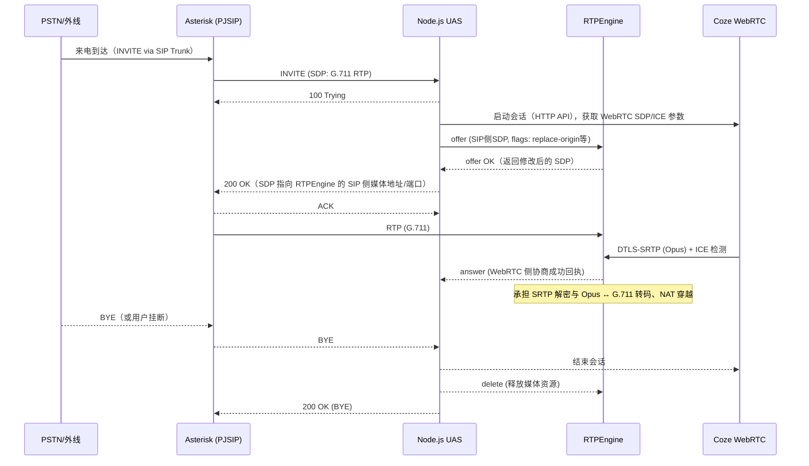

# 呼叫信令与媒体流程

本文档以呼入电话为例，展示 Asterisk ↔ Node.js（UAS）↔ RTPEngine ↔ Coze（WebRTC）之间的信令与媒体交互。

## 1. 时序图（呼入接听 → 媒体桥接 → 挂断）

## 2. 关键步骤说明

1) Asterisk 路由 INVITE 至 Node.js UAS（根据 extensions.conf）。
2) Node.js 立即回复 100 Trying，启动 Coze 会话，向 RTPEngine 申请会话（offer）。
3) RTPEngine 返回修饰后的 SIP 侧 SDP；Node.js 构造 200 OK 发送给 Asterisk。
4) Asterisk 开始向 RTPEngine 发送 G.711 RTP；Coze 端与 RTPEngine 完成 ICE/DTLS 协商，建立 SRTP/Opus。
5) 通话结束时，任一侧 BYE 都应触发：释放 RTPEngine 会话、终止 Coze 会话、回复 200 OK。

## 3. 可选路径
- 早期媒体（183 Session Progress + SDP）可用于回铃声；但建议简化为直接 200 OK 以降低复杂性。
- 如需保持媒体路径稳定，可在 200 OK 前完成 RTPEngine 的资源预留，并设置超时回收。

## 4. 异常与回退
- SDP 协商失败：回复 488 Not Acceptable Here 或 500 Server Internal Error，并记录原因。
- DTLS/ICE 失败：尝试备用 TURN，或回退策略并终止通话。
- RTPEngine 控制失败：快速重试（指数退避），超过阈值则熔断与告警。
